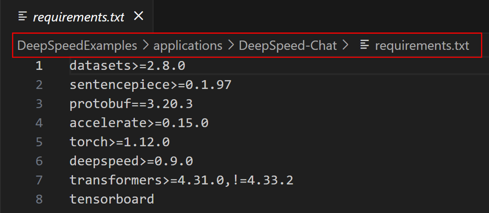

# Assignment 3: Fine-tune LLaMA3.1 Using DeepSpeed-Chat

## 1. Clone Deepspeed Repo from Github

Clone DeepSpeedExamples into your working directory ($WORK or $SCRATCH)
https://github.com/microsoft/DeepSpeedExamples.git

## 2. Preparations for Fine-tuning

### 2.1 Set the Environment using your own directories

```bash
# Activate venv
source /pscratch/sd/e/es_lh/venv/env1/bin/activate

# Working directory
cd /work/09979/esther_lh/ds_chat_new/DeepSpeedExamples/applications/DeepSpeed-Chat/training/step1_supervised_finetuning

# Huggingface cache directory
export HF_HOME=/pscratch/sd/e/es_lh/DeepSpeedExamples/applications/DeepSpeed-Chat/training/cache/huggingface_cache
```

### 2.2 Install Required Packages

Locate the ***requirements.txt*** file from the path below and install all the required packages in your virtual environment.



* Make sure that your pip is upgraded to the latest version.

* Pytorch 2.1.2 with cuda 11.8 works well in the current setup. You can simply install this version by:

```bash
pip install torch==2.1.2 torchvision==0.16.2 torchaudio==2.1.2 --index-url https://download.pytorch.org/whl/cu118
```

### 2.3 Download the Pre-trained Model from Huggingface

I recommend downloading the pre-trained models before starting training to avoid potential issues with Huggingface when submitting a Slurm script.

* First, ensure you have approval to access the **meta-llama/Llama-3.1-8B-Instruct** model and then create an Access Token.

* Using `huggingface-cli login` command to log in to your Huggingface account with the Access Token.

* After logging in, you can proceed to download the pre-trained models. The simpliest way is to download using the command below.

```bash
huggingface-cli download meta-llama/Llama-3.1-8B-Instruct
```

* After downloading, set ***model_name_or_path=meta-llama/Llama-3.1-8B-Instruct*** in your training script.

### 2.4 Prepare datasets

For this assignment, you are only required to use **Dahoas/rm-static** as the training dataset. This is the default dataset for DeepSpeed and can be easily accessed by using the ***--sft_only_data_path Dahoas/rm-static*** parameter. For a detailed introduction to the dataset, please refer to the link below:

https://huggingface.co/datasets/Dahoas/rm-static

You are also welcome to use your own dataset--just follow the guidelines provided. Please note that DeepSpeed requires local datasets to be in a specific format. To use your dataset, ensure it adheres to these rules:

* Pass ***"local/jsonfile"*** as the dataset name to the "--data_path" argument. Use the "--sft_only_data_path" arg instead if you are only doing the supervised fine-tuning step.
* Put your train data and evaluation data in applications/DeepSpeed-Chat/data/ with name train.json and eval.json.
* The json data in file should be a single list with each item like ***{"prompt": "Human: I have a question. Assistant:", "chosen": "Good answer.", "rejected": "Bad answer."}***.

When you use your own dataset files and modify some data in them, pay attention to the parameter "reload" of create_prompt_dataset function. You should pass a True value to it or the cache files will not refresh.

### 2.6 Modify *main.py* and *utils.py*

I made some modification in *main.py* file to implement checkpoint saving. And I also modified *utils* to accommodate the pre-trained LLaMA 3 model class. 

I attached the *"main_ckpt.py"* and *"utils.py"* files for your reference.

Replace the DeepSpeedExamples/applications/DeepSpeed-Chat/training/step1_supervised_finetuning/main.py with [main_ckpt.py](main_ckpt.py).

Replace the DeepSpeedExamples/applications/DeepSpeed-Chat/dschat/utils/utils.py with [utils.py](utils.py).

## 3. Start to train!

Use **2 nodes (4 GPUs each)** for this task.

First, **run an interactive batch job** to facilitate debugging.

Once everything is working well, **create a Slurm script** for submission. DeepSpeed-Chat provides training scripts as examples for your reference. 

In this assignment, you only need to run for **100 steps**.

Observe the loss changes and **plot a graph titled "Loss vs. Time"** that demonstrates how the loss evolves during this period.

##

In this Assignment, we are only utilizing the first step of the DeepSpeed framework: Supervised Fine-Tuning. For more comprehensive information about DeepSpeed and its additional capabilities, I recommend you to read the official DeepSpeed documentation available on GitHub.

